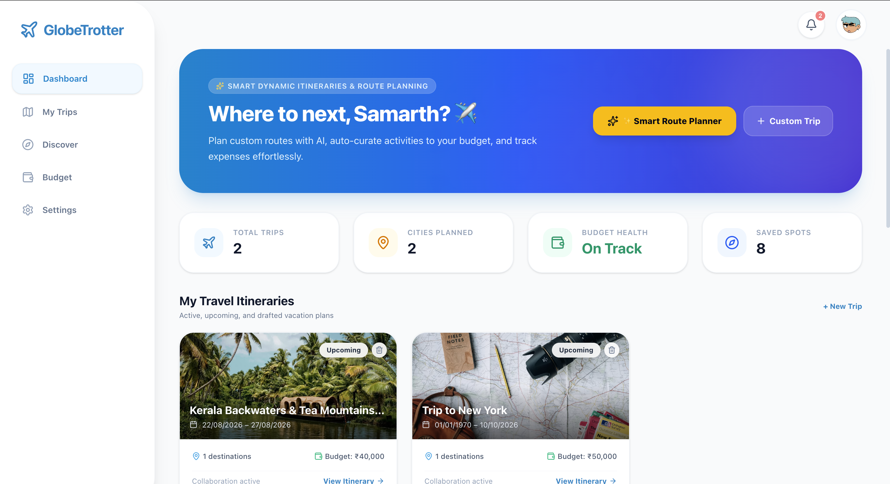
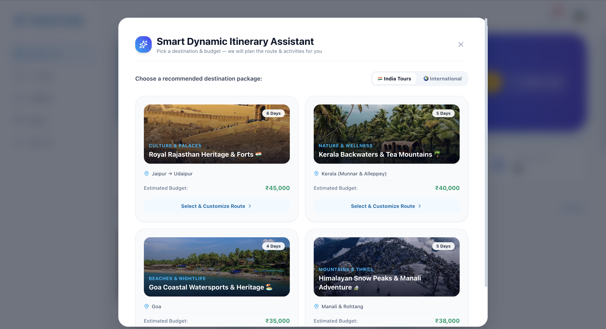
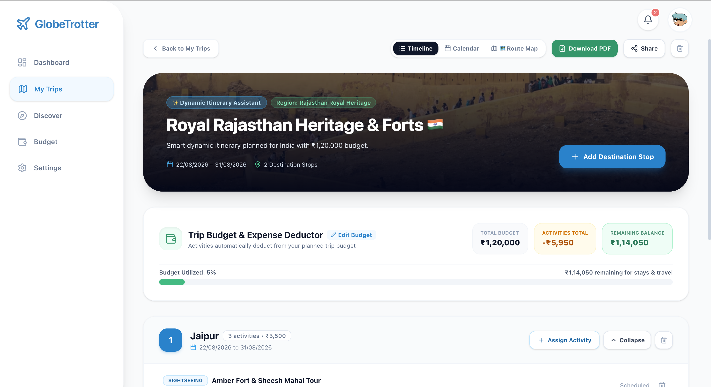
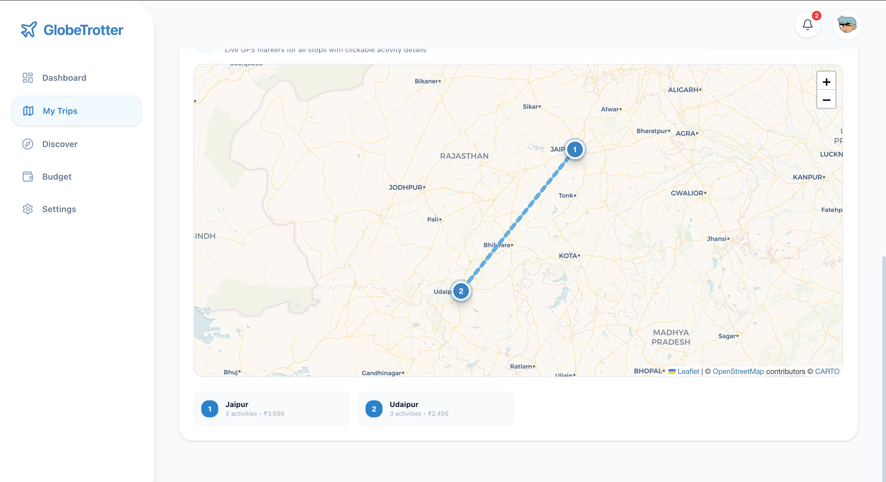
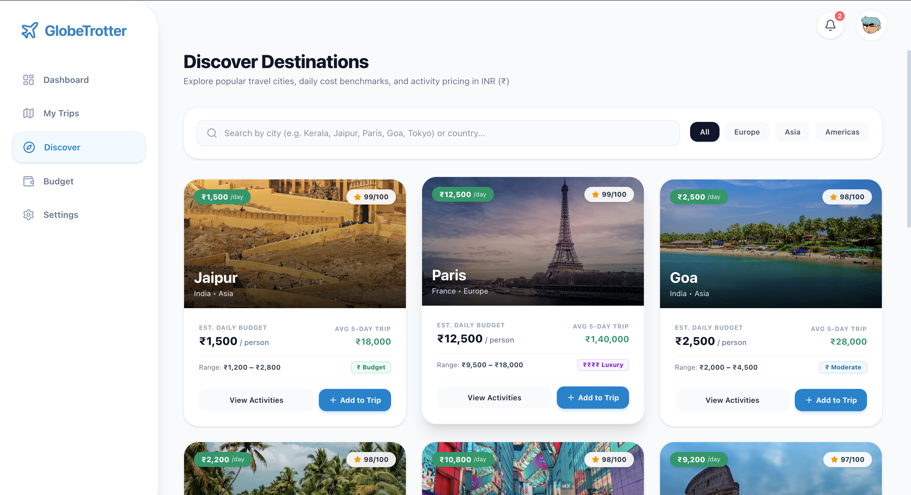
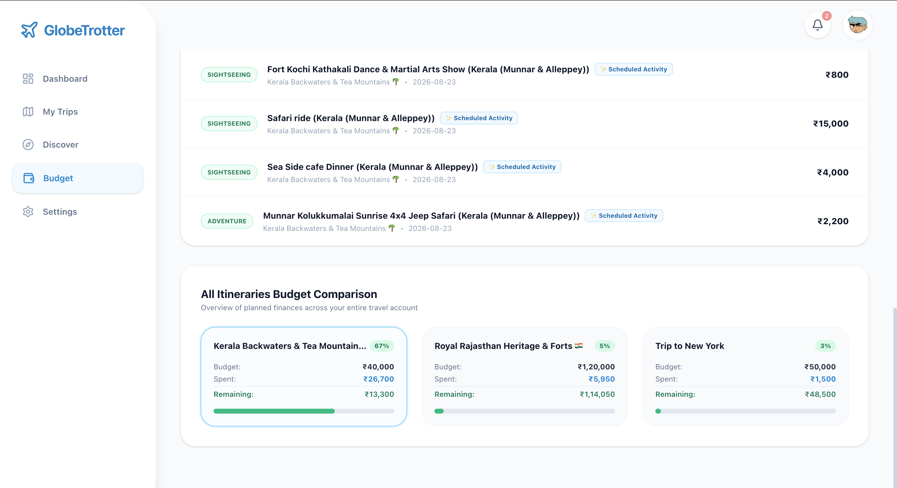
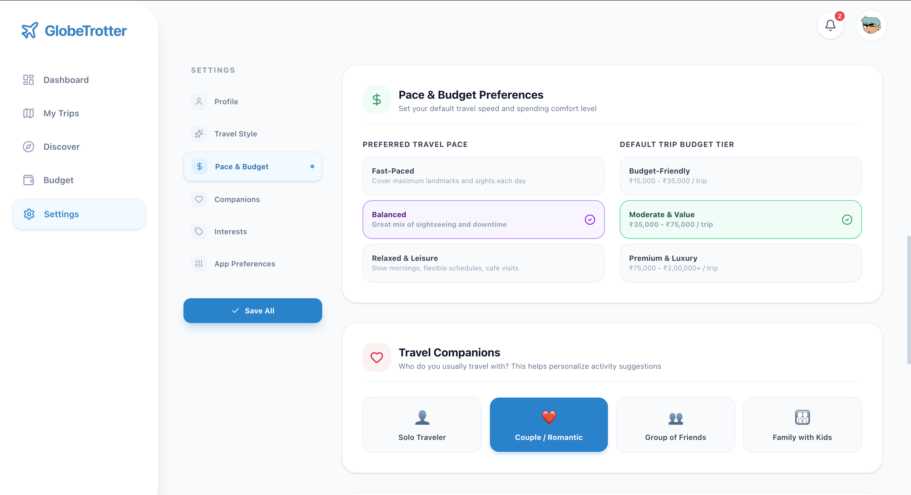
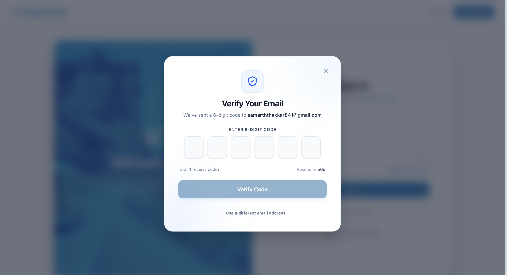

# 🎨 GlobeTrotter — Frontend Client

<p align="center">
  
</p>

<p align="center">
  <strong>Modern Single Page Application built with React 19, Vite 8, Tailwind CSS v4, Leaflet Maps, and Socket.IO</strong>
</p>

---

## 📸 Application Screenshot Tour

| Dashboard Overview | Smart Itinerary Generator |
|:---:|:---:|
|  |  |

| Itinerary Builder & Budget Deductor | Interactive GPS Leaflet Map |
|:---:|:---:|
|  |  |

| Discover Destinations & Cost Benchmarks | Budget Tracker & Transaction Ledger |
|:---:|:---:|
|  |  |

| Travel Persona & Preferences | Multi-Auth & Password Recovery |
|:---:|:---:|
|  |  |

---

## 🏗️ Frontend Architecture & Component Hierarchy

```mermaid
graph TD
    App[App.jsx] --> AuthProvider[AuthContext.jsx]
    AuthProvider --> SocketProvider[SocketContext.jsx]
    SocketProvider --> Layout[Dashboard Layout / Outlet]

    Layout --> Sidebar[Sidebar.jsx]
    Layout --> Topbar[Topbar.jsx]
    Layout --> Pages[Active Page Component]

    Pages --> Dash[DashboardHome.jsx]
    Pages --> Trips[MyTrips.jsx]
    Pages --> Builder[ItineraryBuilder.jsx]
    Pages --> Discover[Discover.jsx]
    Pages --> Budget[BudgetTracker.jsx]
    Pages --> Settings[Settings.jsx]
    Pages --> PublicView[PublicItinerary.jsx]

    Builder --> RouteMap[TripRouteMap.jsx (Leaflet)]
    Builder --> PDFGen[jsPDF Document Generator]
    Builder --> ActivityModal[Assign Activity Modal]
    Builder --> StopModal[Add Stop Modal]
    Builder --> DelModal[ConfirmDeleteModal.jsx]

    Dash --> SmartModal[SmartItineraryPlannerModal.jsx]
```

---

## 🛠️ Key Libraries & Technologies

* **React 19** (`react`, `react-dom`): Latest Concurrent Rendering & Hooks
* **Vite 8** (`vite`, `@vitejs/plugin-react`): Lightning-fast HMR and bundling
* **Tailwind CSS v4** (`@tailwindcss/vite`): Modern zero-config utility-first styling
* **Leaflet & OpenStreetMap** (`leaflet`): Free, lightweight interactive GPS mapping
* **jsPDF & AutoTable** (`jspdf`, `jspdf-autotable`): Client-side PDF generation
* **Framer Motion** (`framer-motion`): Fluid spring physics and route transitions
* **Lucide Icons** (`lucide-react`): Consistent icon typography
* **Socket.IO Client** (`socket.io-client`): Real-time bi-directional collaboration
* **Axios** (`axios`): HTTP client with automatic JWT bearer authorization

---

## 🚀 Running Locally

```bash
# 1. Install dependencies
npm install

# 2. Run Vite development server
npm run dev

# 3. Production build
npm run build

# 4. Preview production bundle
npm run preview
```

Server runs by default at `http://localhost:5173`.
